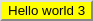

# JSX to MD

## JSX to markdown, just like that... 

### 1.0.0 

#### 1.0.0 

##### 1.0.0 

##### 1.0.0 

[Click me](https://github.com/solidsnail/)

`Hello world`

```jsx
<Button>Coool</Button>
```

> A quote here


- [x] Do this

- [ ] Do that

**1.0.0**

*1.0.0*

~~1.0.0~~


* First item
   - This is the first item content
   - This is the first item content
   - This is the first item content


* Second item
   - This is the second item content


* Third item
   - This is the third item content


1. First item
   - This is the first item content
   - This is the first item content
   - This is the first item content


2. Second item
   - This is the second item content


3. Third item
   - This is the third item content


